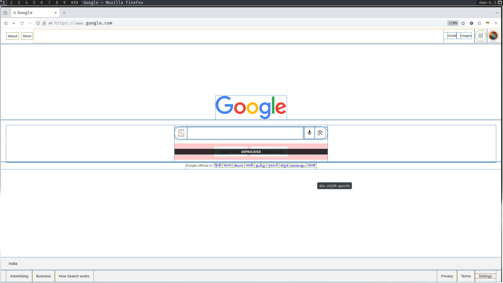

# Border Patrol

Border Patrol is a Firefox extension that adds borders (okay, technically CSS outlines)
to all HTML elements on a page to assist with layout debugging. When you hover over
an element, it displays a tooltip with the tag name and its classes, and also
indicates if any deprecated tags are used. Each element also has a different color
to help visually distinguish, compare, or contrast similar and different elements
on the page.

I created this extension to improve my workflow with Tailwind. It allows me to see
applied utility classes and debug layouts at a glance, without needing to open
the inspector :p

## License

This project is open source and available under the AGPL-3.0 license.
